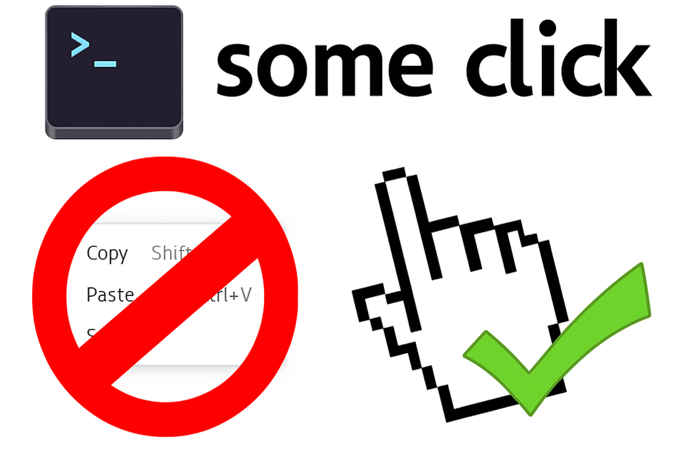

# GNOME Console with Someclick

This is **patched** [kgx (GNOME Console)](https://gitlab.gnome.org/GNOME/console): now you can right-click to copy/paste (as in Windows)

[Available in AUR](https://aur.archlinux.org/packages/someclick)
